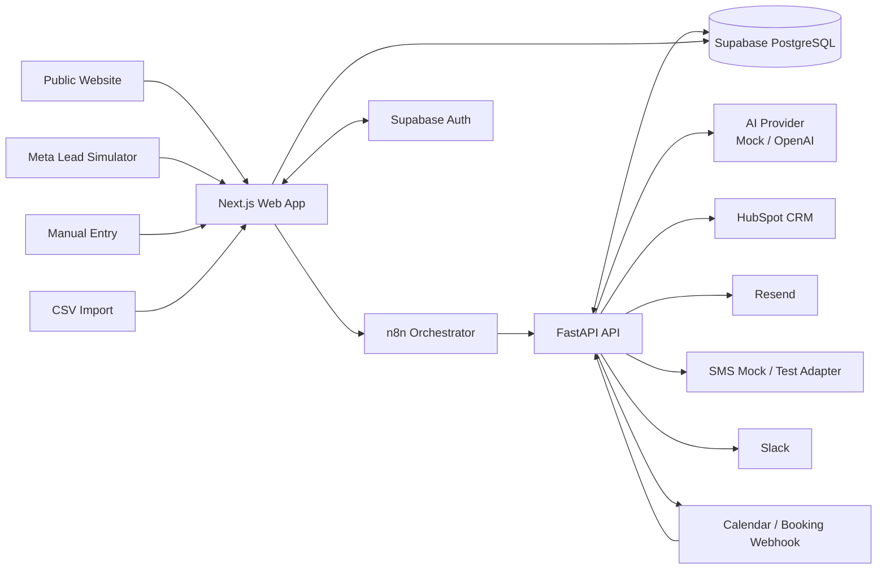
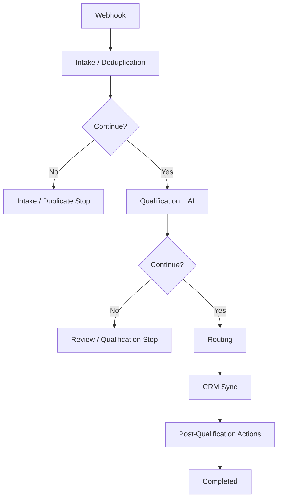
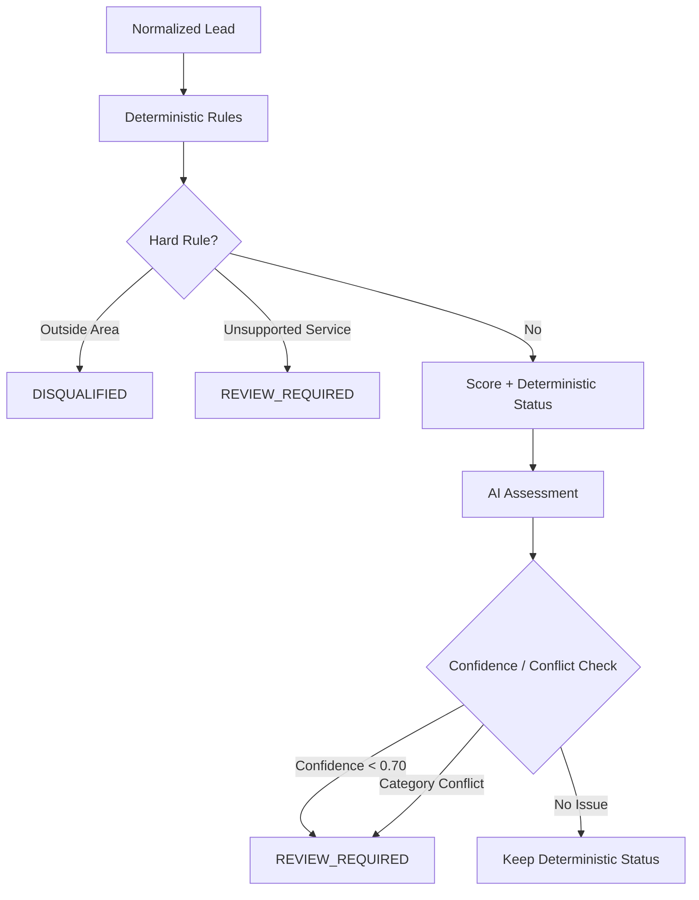
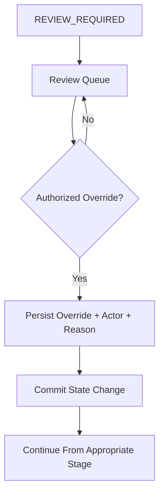
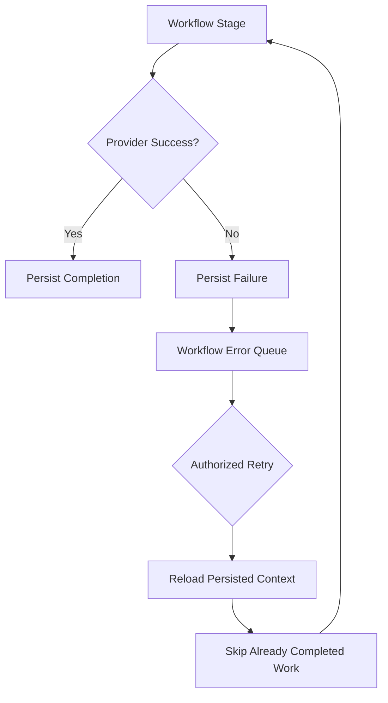

# LeadFlow AI Architecture

> Portfolio project for the fictional NorthStar Home Services. All demo and acceptance data is synthetic.

## 1. Purpose

LeadFlow AI is a lead-operations automation system. It takes an incoming service enquiry through validation, qualification, routing, CRM synchronization, communication, booking, human review, and recovery while keeping the workflow auditable.

The architecture separates orchestration from business logic:

- **n8n** controls workflow progression.
- **FastAPI** owns validation, qualification, routing, provider adapters, persistence rules, and retry-safe stage behavior.
- **Supabase PostgreSQL** is the operational source of truth and audit store.
- **HubSpot** is the CRM system of record for contacts and deals.
- **Next.js** provides the public intake pages and authenticated operations dashboard.

I kept these responsibilities separate so important business rules are not hidden inside visual workflow nodes.

## 2. High-Level Architecture



## 3. Main Processing Flow

The production n8n workflow is stored at:

```text
automation/n8n/workflows/LeadFlow AI - Lead Orchestrator v1.json
```



n8n controls **when** each stage runs. FastAPI controls **what each stage means**.

Each stage reloads persisted lead state instead of trusting transient n8n payloads. Supabase is therefore the authoritative context between stages.

## 4. Intake and Canonical Lead Model

Supported portfolio sources:

- public website form;
- synthetic Meta Lead Ads simulator;
- authenticated manual entry;
- CSV test import;
- direct API intake.

All sources eventually enter the same canonical intake logic.

Core intake responsibilities:

1. validate the submitted structure;
2. normalize identity and business fields;
3. assign source and correlation identifiers;
4. preserve the source event;
5. enforce event idempotency;
6. detect existing customers;
7. persist the lead before downstream work begins;
8. write workflow/audit events.

This prevents every lead source from implementing its own qualification or CRM logic.

## 5. Idempotency and Duplicate Control

LeadFlow distinguishes between two cases.

### Same event

```text
same idempotency key
        |
        v
return existing intake result
        |
        v
do not repeat downstream side effects
```

### Same customer, new event

```text
new source event
      +
existing customer identity
        |
        v
preserve source event
        |
        v
link / update existing customer context
        |
        v
avoid duplicate CRM identity
```

This distinction lets the system retain source history without turning retries or repeat submissions into duplicate CRM records.

## 6. Qualification Architecture



The deterministic engine considers service area, supported service, urgency, timeline/readiness evidence, data completeness, source quality, and configured score bands.

The AI layer returns structured fields such as intent, service category, urgency, confidence, summary, risk flags, and explanation.

AI cannot bypass hard business rules. Low confidence or conflicting categories create `REVIEW_REQUIRED`.

The repository contains both a deterministic mock provider for repeatable testing and an OpenAI provider adapter.

## 7. Human Review and Overrides



The override is persisted before external continuation. This prevents a provider action from occurring before the human decision itself is durable.

Roles currently include:

```text
ADMIN
OPERATIONS_MANAGER
OPERATOR
REVIEWER
```

High-impact override and retry actions are restricted server-side.

## 8. Routing

Routing rules live in PostgreSQL and can consider:

- service type;
- service zone;
- weekday;
- business hours;
- timezone;
- owner;
- queue;
- availability;
- priority.

Fallback routing is stored separately.

Environment-specific HubSpot owner IDs are applied through:

```text
apps/api/scripts/provision_routing.py
```

This keeps portable seed data independent of one HubSpot account.

## 9. CRM Synchronization

HubSpot is accessed through a provider adapter.

The CRM stage handles:

- contact lookup by normalized email/phone;
- contact create/update;
- deal create/update;
- contact/deal association;
- owner assignment;
- pipeline/stage mapping;
- local persistence of provider IDs;
- replay-safe synchronization.

```text
completed CRM stage
       +
workflow retry
        |
        v
reuse existing HubSpot identity
        |
        v
do not create another contact/deal
```

Provider failures are persisted rather than disappearing as log-only exceptions.

## 10. Communications and Booking

Post-qualification actions use database-backed message templates.

Current channels/adapters include:

- Resend email;
- SMS mock/test path;
- Slack;
- booking-link and appointment persistence.

Typical behavior:

```text
HOT  -> booking link + email + SMS/test + Slack
WARM -> follow-up email
COLD -> nurture only when consent allows it
```

For a COLD lead without consent, the nurture action is persisted as `SKIPPED` rather than silently omitted.

Appointments are stored separately and booking webhooks update appointment state.

## 11. Failure Recovery



Example:

```text
HubSpot sync = complete
Email        = failed

manual retry
    |
    +--> reuse HubSpot state
    |
    +--> retry failed communication
```

## 12. Operational Data Model

| Area | Purpose |
| --- | --- |
| `leads` | Canonical operational lead state |
| source-event records | Intake/source history and idempotency |
| `qualification_results` | Deterministic score, AI result, confidence and final state |
| `routing_rules` / `routing_config` | Assignment rules and fallback configuration |
| CRM state fields | HubSpot IDs and synchronization state |
| `message_templates` | Approved outbound templates |
| `communications` | Sent, failed and skipped communications |
| `appointments` | Booking-link and appointment state |
| `workflow_events` | Audit timeline and correlation trail |
| `workflow_errors` | Recoverable workflow/provider failures |
| `lead_overrides` | Human override history |
| `operator_profiles` | Application roles and operator metadata |

The database is the durable workflow state, not only dashboard storage.

## 13. Authentication and Authorization

Supabase Auth provides operator identity. Next.js checks protected dashboard access, and PostgreSQL Row Level Security protects operational tables exposed to authenticated users.

The local demo operator is provisioned through:

```text
apps/api/scripts/provision_demo_operator.py
```

The provisioner synchronizes the configured password and verifies a real password login so a clean rebuild does not depend on historical Auth state.

## 14. Security Boundaries

Current design choices include:

- real secrets excluded from Git;
- `.env.example` without real credentials;
- server-only service-role credentials;
- internal token for orchestration stage endpoints;
- authorization-controlled overrides and retries;
- signed calendar webhook handling;
- idempotency controls for source events;
- hard rules that AI cannot override;
- synthetic portfolio data.

Remaining production-hardening work is tracked in `requirements-matrix.md`.

## 15. Deployment and Reproducibility

Local execution uses local Supabase, Docker Compose for FastAPI and n8n, and the Next.js development server.

A clean rebuild has been exercised through:

```text
fresh Supabase database
        |
        v
all migrations
        |
        v
seed.sql
        |
        v
routing provisioning
        |
        v
demo operator provisioning
        |
        v
configuration checks
        |
        v
automated acceptance suite
```

Current automated result:

```text
9 core acceptance tests
7 live integration tests
16 total
```

This proves the tested behavior does not depend on historical local database state. It does not mean every requirement in the original client brief has already been acceptance-verified.

## 16. Key Design Decisions

### Business rules before AI

Hard operational decisions stay deterministic. AI can add interpretation and trigger review, but it cannot make an out-of-area lead serviceable or bypass consent rules.

### n8n orchestrates; FastAPI owns rules

The workflow remains visible without turning n8n nodes into the undocumented source of business truth.

### Persistence between stages

Each stage can reload authoritative state, which makes continuation and retry safer.

### Idempotency at several layers

Intake, CRM identity, communications, and appointments all need duplicate protection because replay can happen at more than one point.

### Human review is a real state

Uncertainty stops progression and becomes visible work for an operator.

### Environment-specific configuration stays out of seed data

CRM owner IDs and demo credentials are provisioned after migrations and seed data, keeping the repository portable.

## 17. Known Gaps Before Full Client-Brief Acceptance

The architecture works, but the original brief includes requirements beyond the current 16-test suite.

The main remaining items are tracked in:

```text
docs/requirements-matrix.md
```

Important examples include:

- explicit security/authentication of the website intake webhook;
- full dashboard requirement coverage;
- Slack alerting for final/dead-letter failures;
- performance and burst evidence;
- some provider-failure scenarios;
- accessibility and production-security review;
- final handover, case-study, and demo assets.

Keeping these gaps visible is intentional. The portfolio should show what was actually verified instead of claiming completion from a green test suite alone.
